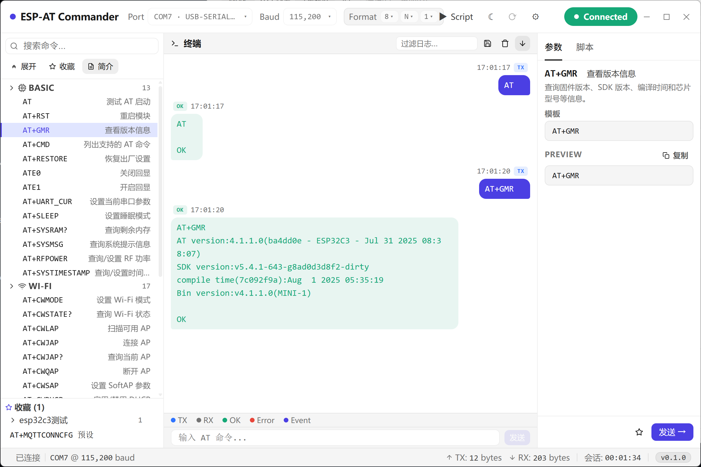

<div align="center">


# 📡 ESP-AT Commander

**面向乐鑫 ESP32 / ESP8266 模组的桌面端 AT 指令调试工具**
*脚本化 · 收藏 · 模板 · 零云依赖*

[简体中文](README.md) · [📝 更新日志](https://github.com/NingZiXi/ESP-AT-Commander/releases) · [🐛 反馈问题](https://github.com/NingZiXi/ESP-AT-Commander/issues) · [👤 作者主页](https://github.com/NingZiXi)

---

[](LICENSE)
[](https://tauri.app)
[](https://react.dev)
[](https://www.rust-lang.org)
[](#-快速开始)
[](https://github.com/NingZiXi/ESP-AT-Commander/releases)

</div>

---

## 📌 概述

**ESP-AT Commander** 是一款专为乐鑫 **ESP32 / ESP8266** 系列 Wi-Fi 模组设计的桌面端 AT 指令调试工具。它把串口交互、指令参数化、脚本化测试、收藏复用等流程集中到一个原生窗口里,无需切换 PuTTY / Xshell / VSCode Serial Monitor,一个应用搞定所有调试需求。

底层基于 **Tauri 2** + **React 19** + **Rust** 构建,打包后单文件约 **10 MB**,冷启动 < **1 s**,完全离线运行,无任何云端依赖。

## ✨ 特性

- **🛰️ 串口调试** — 自动枚举串口,自定义数据位 / 校验位 / 停止位,本地持久化,断线自动重连
- **📡 指令面板** — 按 Wi-Fi / Bluetooth / Radio 分类浏览所有 ESP-AT 命令,模糊搜索 + 参数表单 + 双击发送
- **📜 脚本化测试** — YAML 描述多步骤流程,顺序执行 send / wait / delay,支持拖拽排序、批量编辑、复制粘贴、步骤模板与草稿自动恢复
- **⭐ 收藏 & 设置** — 命令按自定义分组管理,设置中心统一管理主题、波特率、行尾、数据导入导出等
- **🛡️ 稳定可靠** — 错误兜底覆盖层保证窗口永不白屏,三档响应式断点适配小窗口,浅色 / 深色 / 跟随系统三种主题

## 📸 截图



## ⬇️ 直接下载

无需编译，开箱即用：

| 平台 | 下载 |
| --- | --- |
| **Windows** | [ESP-AT.Commander_0.1.0_x64-setup.exe](https://github.com/NingZiXi/ESP-AT-Commander/releases/latest/download/ESP-AT.Commander_0.1.0_x64-setup.exe) |
| **macOS** | [ESP-AT.Commander_0.1.0_aarch64.dmg](https://github.com/NingZiXi/ESP-AT-Commander/releases/latest/download/ESP-AT.Commander_0.1.0_aarch64.dmg) |
| **Linux** | [ESP-AT.Commander_0.1.0_amd64.AppImage](https://github.com/NingZiXi/ESP-AT-Commander/releases/latest/download/ESP-AT.Commander_0.1.0_amd64.AppImage) |

> 所有平台版本：https://github.com/NingZiXi/ESP-AT-Commander/releases/latest

## 🛠️ 快速开始

### 1️⃣ 环境要求

| 工具 | 版本 |
| --- | --- |
| **Node.js** | ≥ 20 |
| **pnpm** | ≥ 9 |
| **Rust** | stable(1.78+) |
| **Tauri 2 系统依赖** | Windows: WebView2 + MSVC Build Tools · macOS: Xcode CLT · Linux: webkit2gtk + libsoup |

### 2️⃣ 克隆 & 安装

```bash
git clone https://github.com/NingZiXi/ESP-AT-Commander.git
cd ESP-AT-Commander
pnpm install
```

### 3️⃣ 开发模式

```bash
pnpm tauri:dev
```

启动 Vite 开发服务器 + Rust 后端,前端代码热更新。

### 4️⃣ 生产打包

```bash
pnpm tauri:build
```

产物在 `src-tauri/target/release/bundle/`,各平台对应:

| 平台 | 产物格式 |
| --- | --- |
| Windows | `.msi` / `.exe` |
| macOS | `.dmg` / `.app` |
| Linux | `.deb` / `.AppImage` |

## ⌨️ 快捷键

| 范围 | 快捷键 | 作用 |
| --- | --- | --- |
| 全局 | `Ctrl + L` | 清空终端日志 |
| 全局 | `Ctrl + K` | 聚焦命令搜索框 |
| 全局 | `Ctrl + ,` | 打开设置中心 |
| 全局 | `Esc` | 关闭弹窗 / 取消操作 |
| 脚本 | `Ctrl + S` | 保存当前脚本 |
| 脚本 | `Ctrl + Z` | 把最后一步移到开头 |
| 脚本 | `Ctrl + Shift + Z` | 把开头一步移到末尾 |
| 终端 | `↑` / `↓` | 切换历史命令 |
| 终端 | `Enter` | 发送当前输入 |
| 窗口 | `F11` | 切换全屏 |

> 完整列表在应用内 `设置 → 快捷键`。

## 🔌 插件系统

指令集通过 `plugins/<plugin-id>/` 目录动态加载,新增一个设备家族只需新增一个目录:

```
plugins/
└── esp-at/                 # 默认 ESP-AT 指令集
    ├── plugin.json          # 插件元信息
    ├── commands.json        # 指令定义
    ├── parser.json          # 响应解析规则
    └── scripts/             # 内置脚本
        ├── wifi-connect.yaml
        ├── mqtt-test.yaml
        └── user/            # 用户脚本(自动持久化在此)
```

编写自定义插件请参考 `plugins/esp-at/` 的目录结构和字段定义。

## 📁 项目结构

```
ESP-AT-Commander/
├── frontend/                # React + Vite 前端
│   ├── src/
│   │   ├── components/      # 组件(CommandTree / Terminal / ScriptPanel ...)
│   │   ├── stores/          # Zustand 状态(serial / logs / favorites / settings ...)
│   │   ├── styles/          # CSS Token
│   │   └── types/           # TypeScript 类型
│   └── package.json
├── src-tauri/               # Rust 后端
│   ├── src/
│   │   ├── lib.rs           # Tauri commands + 串口 / 插件加载逻辑
│   │   └── main.rs
│   ├── icons/               # 应用图标(由 app-icon.svg 生成)
│   └── tauri.conf.json
├── plugins/                 # 设备指令集插件
├── app-icon.svg             # 源图标(Tauri icon 命令从这里生成)
└── package.json             # 工作区根
```

## 💾 数据存储

| 数据 | 位置 |
| --- | --- |
| 串口配置 / 主题 / 设置 | 浏览器 `localStorage`(由 Tauri 持久化) |
| 用户脚本 | `plugins/<id>/scripts/user/*.yaml` |
| 收藏 / 模板 / 草稿 | 浏览器 `localStorage` |
| 终端日志 | 内存(可配置最大条数) |

应用内 `设置 → 数据` 可一键导出 / 导入全部本地数据为 JSON。

## 🗺️ 路线图

- [ ] 多插件并行加载(目前只支持单插件)
- [ ] 十六进制收发视图
- [ ] AT 响应时间统计 & 图表
- [ ] 脚本调试断点
- [ ] i18n 英文界面
- [ ] 插件市场

## 🤝 贡献

欢迎 PR / Issue。提交前请:

1. ✅ `pnpm lint` 通过
2. ✅ `pnpm tauri:dev` 手动验证主要场景
3. ✅ 涉及 Rust 改动时附 `cargo test` 输出
4. ✅ 提交信息遵循 [Conventional Commits](https://www.conventionalcommits.org/zh-hans/)

## 📄 许可证

本项目基于 [MIT](LICENSE) 协议开源。

```
MIT License

Copyright (c) 2026 NingZiXi
```

## 👤 作者

**NingZiXi** — [@NingZiXi](https://github.com/NingZiXi)

---

<div align="center">

如果觉得项目对您有帮助,请给个 ⭐ Star 支持一下!这对我非常重要 🙏

[](https://github.com/NingZiXi/ESP-AT-Commander/stargazers)

</div>
